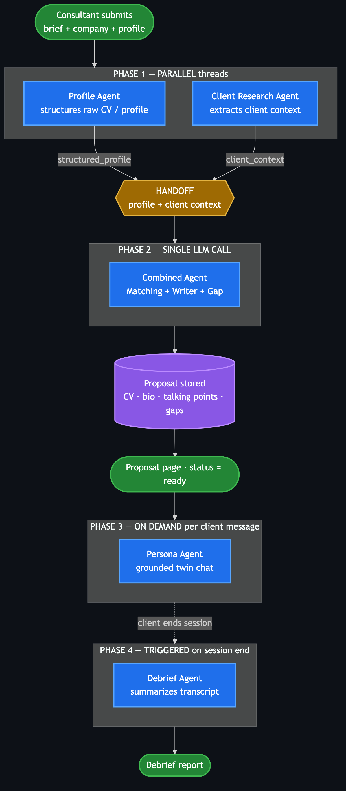
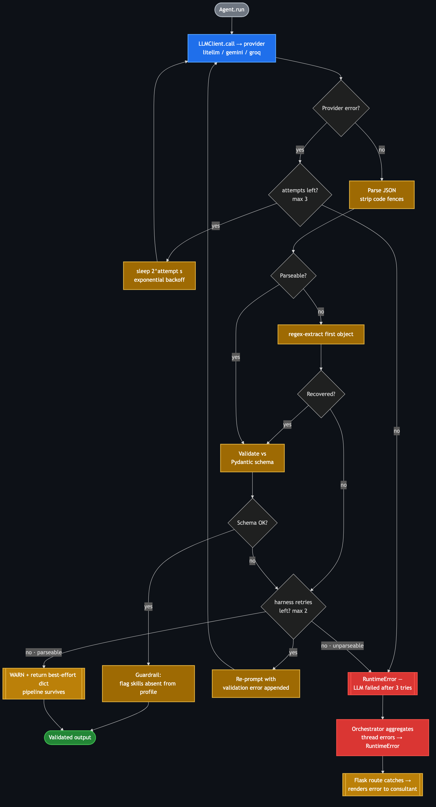

# PitchTwin
**Your CV, came to life.**

A multi-agent AI system for technology consulting firms. Takes a consultant's profile and a client brief → produces a tailored proposal package + an interactive pre-meeting twin experience for the client.

---

## Quick Start (Docker)

```bash
cp .env.example .env
# Edit .env — add your GEMINI_API_KEY or GROQ_API_KEY
docker-compose up --build
```

Open http://localhost:5000

---

## Quick Start (Local with uv)

```bash
# Install uv if not already installed: https://docs.astral.sh/uv/getting-started/installation/
uv sync
cp .env.example .env
# Edit .env with your API key
uv run python app.py
```

Or install uv and run in one command:

```bash
curl -LsSf https://astral.sh/uv/install.sh | sh
uv sync
cp .env.example .env
# Edit .env with your API key
uv run python app.py
```

---

## Demo Flow

1. Open http://localhost:5000
2. Click **Load sample profile & brief** in the demo banner
3. Click the link → **Create proposal for NovaPay Financial**
4. Hit **Generate Proposal Package** — wait ~60s
5. View the tailored CV, bio, talking points, and gap analysis
6. Click **Open Client Twin Link** → copy and open in a new tab
7. Have a conversation as the client
8. Click **End conversation** → debrief is generated
9. Back on the proposal page → click **View Debrief**

---

## Architecture

PitchTwin runs **5 agents across 4 phases**, with two error-recovery layers
(provider retry + backoff, and schema-validate / re-prompt / graceful
degradation). Full breakdown — including the non-happy (error-recovery) path and
a node→source map — in **[docs/architecture-diagrams.md](docs/architecture-diagrams.md)**.

### Happy path — agents & where they interact



### Non-happy path — error recovery



See `spec/spec.arch` for the full blueprint.

---

## Configuration

| Variable | Description |
|---|---|
| `GEMINI_API_KEY` | Google Gemini API key (primary) |
| `GROQ_API_KEY` | Groq API key (fallback) |
| `LLM_PROVIDER` | `gemini` or `groq` (default: `gemini`) |
| `FLASK_SECRET_KEY` | Flask session secret |
| `FLASK_DEBUG` | `1` for debug mode |
| `DB_PATH` | SQLite path (default: `data/pitchtwin.db`) |

---

## Running Tests

```bash
uv run python -m pytest tests/ -v
```

Or with pytest directly:

```bash
uv run pytest tests/ -v
```

Tests use a mock LLM client — no API calls required.

---

## Agent Evals

The 7 agents are quality-gated by a golden-set eval framework (schema, factual
consistency, and an LLM-judge hallucination gate). See **[`evals/README.md`](evals/README.md)**.

```bash
uv run python -m evals.run --agent matching      # one agent
uv run python -m evals.run --all --workers 6      # all agents, in parallel
```

The offline eval meta-tests run as part of `pytest tests/` (and CI); the live
`evals.run` invokes the real model.

---

## Project Structure

```
pitchtwin/
├── app.py               # Flask routes
├── orchestrator.py      # Pipeline runner + threading
├── llm_client.py        # Gemini/Groq wrapper
├── db.py                # SQLite layer
├── models.py            # Dataclasses
├── pyproject.toml       # Project config + dependencies (uv)
├── uv.lock              # Locked dependency versions
├── agents/              # 7 specialized agents
├── templates/           # Flask Jinja2 templates
├── static/css/          # Minimal CSS
├── data/                # Seed data + SQLite DB
├── spec/                # spec.plan, spec.tasks, spec.arch
└── tests/               # Agent unit tests
```