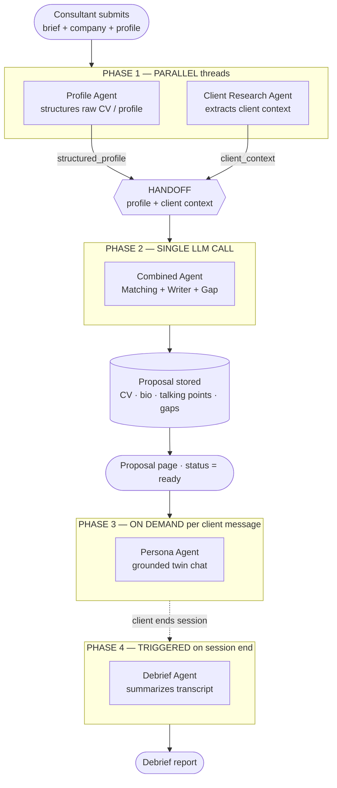

# PitchTwin — Agent Architecture Diagrams

> FUSE 2026 Judges Bonus Challenge — *The Visuals.*
> Mandatory **Happy Path** + **Non-Happy Path (error recovery)** for PitchTwin's
> multi-agent pipeline. Diagrams are self-explanatory; the box→code map at the
> bottom ties every node to the source.

PitchTwin runs **5 agents** across **4 phases**. Phase 2 folds the Matching,
Writer and Gap agents into a single "Combined Agent" LLM call. Resilience lives
in two layers: provider retry + backoff in `LLMClient.call`, and JSON repair /
schema re-prompt / graceful degradation in `AgentHarness`.

PNG renders live in [`docs/diagrams/`](./diagrams). Regenerate with:

```bash
npx -y -p @mermaid-js/mermaid-cli mmdc -i docs/diagrams/happy-path.mmd \
  -o docs/diagrams/happy-path.png -b "#0d1117" -s 2
```

---

## Happy Path — full pipeline & where agents interact




---

## Non-Happy Path — error recovery (one agent call)


---

## Box → code map

| Diagram node | Source |
|---|---|
| Profile Agent | `agents/profile_agent.py` → `run_profile_agent` |
| Client Research Agent | `agents/client_research_agent.py` → `run_client_research_agent` |
| Combined Agent (Matching + Writer + Gap) | `agents/combined_agent.py` → `run_combined_agent` |
| Persona Agent | `agents/persona_agent.py` → `run_persona_agent` |
| Debrief Agent | `agents/debrief_agent.py` → `run_debrief_agent` |
| Phase orchestration / parallel threads / handoff | `orchestrator.py` → `run_proposal_pipeline` |
| Provider retry + exponential backoff | `llm_client.py:50` → `LLMClient.call` |
| JSON parse + fence strip + regex repair | `llm_client.py:107` → `LLMClient.call_json` |
| Schema re-prompt + graceful degradation | `agents/harness.py` → `AgentHarness._run_json` |
| Unsupported-skill guardrail | `agents/harness.py` → `NoHallucinationGuardrail` |
| Top-level error rendering | `app.py` route handlers (`try/except`) |
