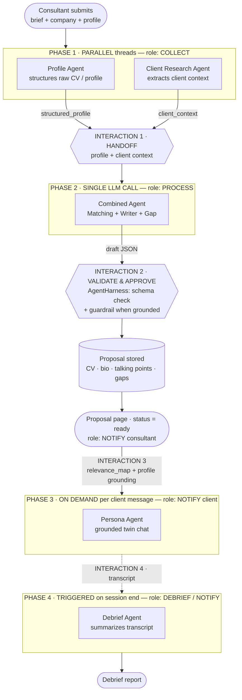
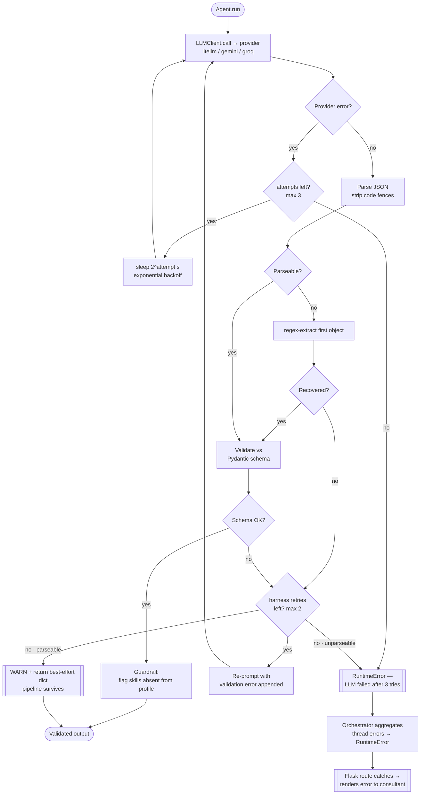

# PitchTwin — Agent Architecture Diagrams

> FUSE 2026 Judges Bonus Challenge — *The Visuals.*
> Mandatory **Happy Path** + **Non-Happy Path (error recovery)** for PitchTwin's
> multi-agent pipeline. Diagrams are self-explanatory; the box→code map at the
> bottom ties every node to the source.

PitchTwin runs **5 agents** across **4 phases**. Phase 2 folds the Matching,
Writer and Gap agents into a single "Combined Agent" LLM call. Resilience lives
in two layers: provider retry + backoff in `LLMClient.call`, and JSON repair /
schema re-prompt / graceful degradation in `AgentHarness`.

PNG renders live in [`docs/diagrams/`](./diagrams). Regenerate with:

```bash
npx -y -p @mermaid-js/mermaid-cli mmdc -i docs/diagrams/happy-path.mmd \
  -o docs/diagrams/happy-path.png -b "#0d1117" -s 2
```

---

## Requirements coverage (issue #35)

| Challenge requirement | Where it's shown |
|---|---|
| **Happy Path** — end-to-end flow | Happy-path diagram: `Consultant submits …` → … → `Debrief report` |
| **Non-Happy Path** — error recovery | Non-happy diagram: provider retry/backoff + schema re-prompt + graceful degradation |
| **Show the agents** | All 5 agents are explicit nodes (Profile, Client Research, Combined, Persona, Debrief) |
| **…and where they interact** | 4 numbered **INTERACTION** points on the happy path |
| **Clearly mark interaction points** | `INTERACTION 1–4` callouts (handoff, validate/approve, grounding, transcript) |

### Agent roles (mapped to the challenge's example template)

| Challenge role | PitchTwin agent(s) | Phase |
|---|---|---|
| Collects Information | Profile Agent + Client Research Agent | 1 (parallel) |
| Processes Data | Combined Agent (Matching + Writer + Gap) | 2 |
| Validates & Approves | `AgentHarness` schema check + no-hallucination guardrail | gate after 2 |
| Notifies User | Proposal page (consultant) · Persona Agent (client) · Debrief Agent | 2 → 3 → 4 |

### Interaction points

1. **HANDOFF** — Profile + Client Research outputs merge into the Combined Agent input.
2. **VALIDATE & APPROVE** — Combined Agent draft passes the harness schema check (+ guardrail when grounded) before it's stored.
3. **GROUNDING** — stored `relevance_map` + structured profile seed the Persona Agent's system prompt.
4. **TRANSCRIPT** — the twin transcript is handed to the Debrief Agent on session end.

---

## Happy Path — full pipeline & where agents interact




---

## Non-Happy Path — error recovery (one agent call)




---

## Box → code map

| Diagram node | Source |
|---|---|
| Profile Agent | `agents/profile_agent.py` → `run_profile_agent` |
| Client Research Agent | `agents/client_research_agent.py` → `run_client_research_agent` |
| Combined Agent (Matching + Writer + Gap) | `agents/combined_agent.py` → `run_combined_agent` |
| Persona Agent | `agents/persona_agent.py` → `run_persona_agent` |
| Debrief Agent | `agents/debrief_agent.py` → `run_debrief_agent` |
| Phase orchestration / parallel threads / handoff | `orchestrator.py` → `run_proposal_pipeline` |
| Validate & Approve gate (schema + guardrail) | `agents/harness.py` → `AgentHarness` / `NoHallucinationGuardrail` |
| Provider retry + exponential backoff | `llm_client.py:50` → `LLMClient.call` |
| JSON parse + fence strip + regex repair | `llm_client.py:107` → `LLMClient.call_json` |
| Schema re-prompt + graceful degradation | `agents/harness.py` → `AgentHarness._run_json` |
| Top-level error rendering | `app.py` route handlers (`try/except`) |
